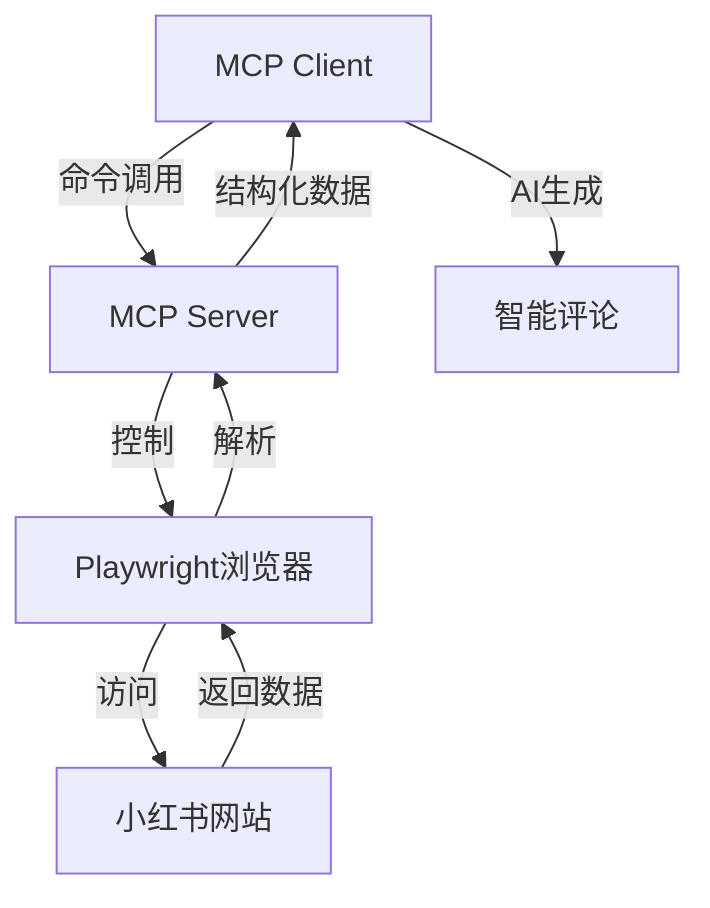

# MCP小红书自动化工具

## 基于 Playwright + FastMCP 的智能搜索与评论系统

<div @click="$slidev.nav.next" class="mt-12 py-1" hover:bg="white op-10">
  按空格键继续 <carbon:arrow-right />
</div>

---

# 项目概述

一款基于 Playwright 开发的小红书自动搜索和评论工具

- 作为 MCP Server 接入客户端（如Claude）
- 深度集成AI能力生成自然评论
- 持久化登录状态
- 模块化设计（笔记分析、评论生成、发布）



---

# 核心功能

## 1. 用户认证与登录

- 持久化登录：首次登录后保存状态，无需重复扫码
- 登录状态管理：自动检测登录状态

## 2. 内容发现与获取

- 智能关键词搜索：支持多关键词搜索
- 多维度内容获取：标题、作者、发布时间、正文

## 3. 内容分析与生成

- 笔记内容分析：提取关键信息识别领域
- AI评论生成：支持引流型、点赞型、咨询型、专业型评论

---

# MCP 功能详解

## 什么是 MCP？

**Model Context Protocol（模型上下文协议）** 是一种让AI助手能够调用外部工具的协议。

## MCP Server 核心能力

| 工具名称 | 功能描述 | 参数说明 |
|----------|----------|----------|
| `login` | 登录小红书账号 | 无参数，自动检测登录状态 |
| `search_notes` | 搜索笔记 | keywords: 搜索关键词, limit: 返回数量 |
| `get_note_content` | 获取笔记详情 | note_url: 笔记链接 |
| `publish_comment` | 发布评论 | note_url: 笔记链接, content: 评论内容 |

## MCP工作流程

1. **客户端调用** → 用户在AI聊天界面调用工具
2. **命令传递** → 通过 stdio 协议发送到MCP Server
3. **执行操作** → Playwright控制浏览器执行
4. **结果返回** → 结构化数据返回给客户端
5. **AI总结** → AI基于结果生成回复

---

# 技术架构


**架构说明：**
- MCP客户端发送命令
- FastMCP服务端接收并处理
- Playwright控制浏览器访问小红书
- 返回数据并解析后返回给客户端

---
layout: two-cols
---

# 安装步骤

## 环境准备

```bash
# 创建虚拟环境
python3 -m venv venv

# 激活虚拟环境
# Windows: venv\Scripts\activate
# macOS/Linux: source venv/bin/activate
```

## 依赖安装

```bash
pip install -r requirements.txt
pip install fastmcp
playwright install
```

::right::

<br>
<br>

## 项目结构

```
Redbook-Search-Comment-MCP2.0/
├── xiaohongshu_mcp.py    # 主程序
├── test_mcp.py           # 测试脚本
├── browser_data/         # 浏览器数据
├── data/                 # 存储数据
└── requirements.txt      # 依赖列表
```

**目录说明：**
- `xiaohongshu_mcp.py` - MCP服务器主程序
- `browser_data/` - 浏览器持久化数据
- `data/` - 搜索结果存储

---
layout: two-cols
---

# MCP Server 配置

## Windows 配置

```json
{
    "mcpServers": {
        "xiaohongshu MCP": {
            "command": "python.exe",
            "args": ["xiaohongshu_mcp.py", "--stdio"]
        }
    }
}
```

**配置路径：**
`~/.continue/config.json`

::right::

<br>
<br>

## VS Code 配置

```json
{
    "servers": {
        "xiaohongshu-mcp-server": {
            "command": "python.exe",
            "args": ["xiaohongshu_mcp.py", "--stdio"],
            "type": "stdio"
        }
    }
}
```

**配置路径：**
`.vscode/mcp.json`

---

# 核心代码解析

## 初始化 FastMCP

```python
from fastmcp import FastMCP

mcp = FastMCP("xiaohongshu_scraper")

BROWSER_DATA_DIR = os.path.join(
    os.path.dirname(os.path.abspath(__file__)), 
    "browser_data"
)
```

## 登录功能

```python
@mcp.tool()
async def login() -> str:
    """登录小红书账号"""
    global is_logged_in
    await ensure_browser()
    if is_logged_in:
        return "已登录小红书账号"
    # ...等待用户扫码登录
    return "登录成功！"
```

---

# 搜索功能实现

```python
@mcp.tool()
async def search_notes(keywords: str, limit: int = 5) -> str:
    # 检查登录状态
    login_status = await ensure_browser()
    if not login_status:
        return "请先登录小红书账号"
    
    # 访问搜索页面
    search_url = f"https://www.xiaohongshu.com/search_result?keyword={keywords}"
    await main_page.goto(search_url)
    
    # 获取帖子卡片并提取信息
    post_cards = await main_page.query_selector_all('section.note-item')
    # ...
```

**搜索流程：**
1. 验证登录状态
2. 构建搜索URL
3. 获取搜索结果
4. 提取笔记标题和链接

---
layout: two-cols
---

# 使用流程


**详细步骤：**
1. 启动 MCP Server
2. 登录小红书（首次需扫码）
3. 搜索关键词获取笔记列表
4. 获取目标笔记详细内容

::right::
<br>
<br>

<br>
<br>
5. AI生成个性化评论
<br>
6. 发布评论到笔记

---

# 实际运行截图

## MCP客户端调用演示


**功能说明：**
- 调用 `search_notes` 工具搜索笔记
- AI自动总结搜索结果
- 支持多关键词搜索

---

# 搜索结果展示
<br>
<br>


---

# 配置文件说明

## 核心依赖

| 依赖 | 作用 |
|------|------|
| fastmcp | MCP协议实现 |
| playwright | 浏览器自动化 |
| pandas | 数据处理 |
| python-dotenv | 环境变量管理 |

## requirements.txt

```txt
fastmcp>=0.1.0
playwright>=1.40.0
pandas>=2.1.0
python-dotenv>=1.0.0
```

---

# 启动方式

## 开发调试

```bash
# 直接运行
python xiaohongshu_mcp.py --stdio

# 测试脚本
python test_mcp.py
```

## 在MCP客户端中使用

1. 配置MCP Server路径
2. 启动MCP客户端
3. 在聊天中调用工具

---

# 注意事项

## 安全提示

- 不要分享账号密码
- 合理控制操作频率
- 遵守平台规则
- 定期清理浏览器缓存

## 故障排除

- 登录失败：检查网络连接
- 搜索无结果：尝试更换关键词
- 评论失败：检查登录状态

---
layout: center
class: text-center
---

# 总结

MCP小红书自动化工具为内容创作者提供了：

- 高效搜索：快速获取目标内容
- AI赋能：智能生成相关评论
- 模块化设计：易于扩展和维护
- 持久化登录：提升使用体验

<PoweredBySlidev mt-10 />
